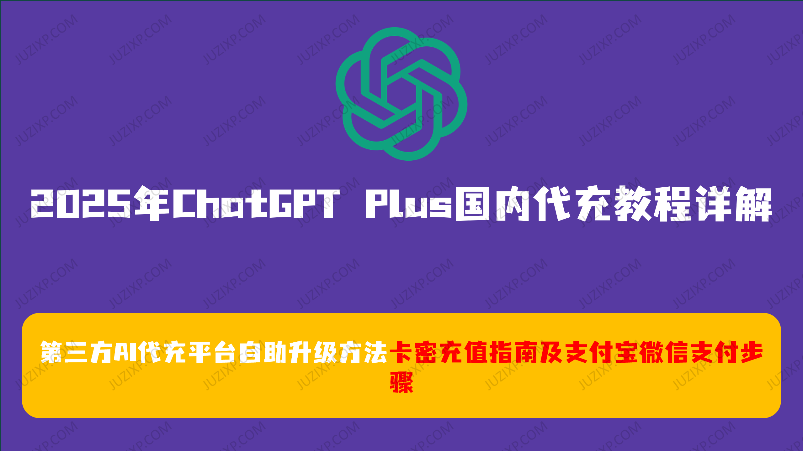
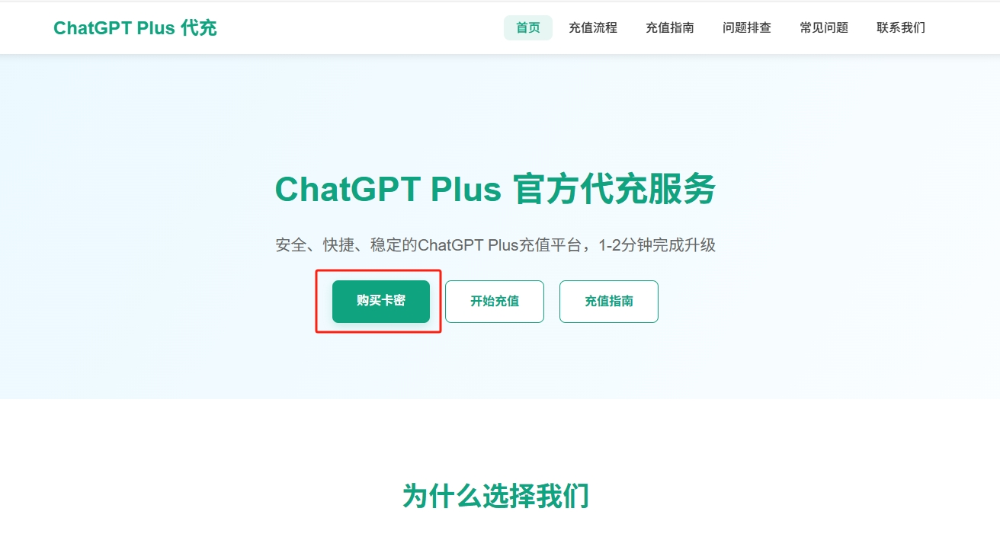
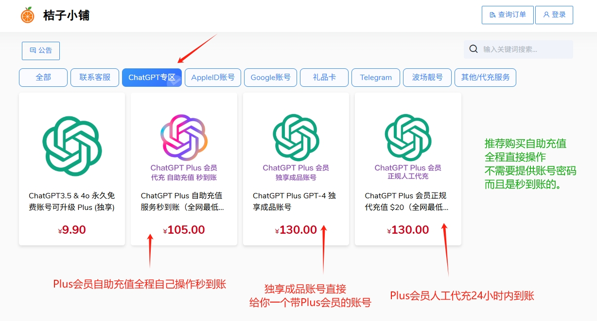
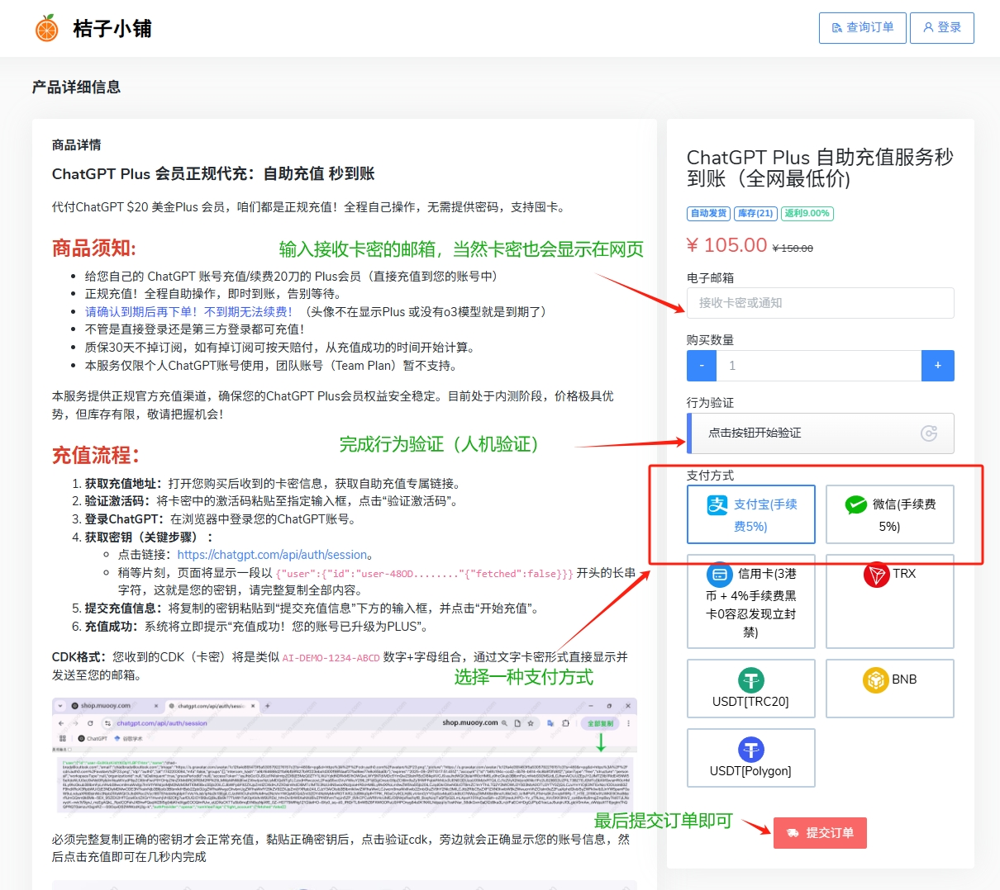
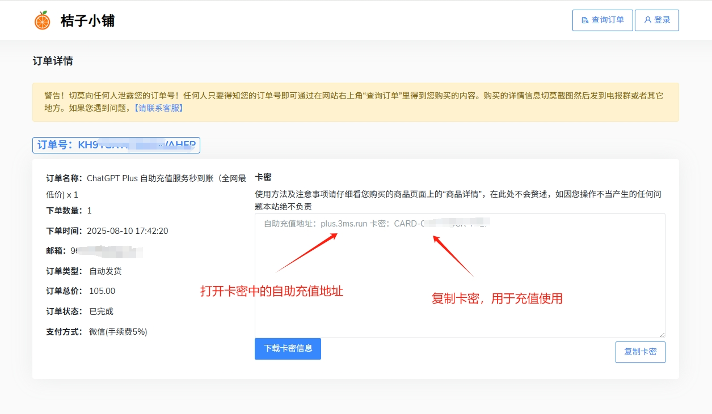

# 2025年ChatGPT Plus国内代充教程详解：第三方AI代充平台自助升级方法、卡密充值指南及支付宝微信支付步骤（新手亲测秒到账，低价可靠平台推荐）

嘿，大家好！我是最近用代充升级了 ChatGPT Plus 的一个上班族，在国内直接充值 OpenAI 会员老是卡在支付那儿，超级烦人。试过各种方法，最后发现第三方代充平台是最省心的，尤其是对新手来说。网上教程五花八门，有些还带坑，我这儿就专注分享代充的玩法，基于我亲身经历，简单粗暴。关键词：ChatGPT Plus 国内代充教程 2025、ChatGPT Plus 第三方AI代充平台推荐、ChatGPT Plus 卡密自助充值方法、OpenAI会员支付宝微信代充指南、ChatGPT Plus 低价秒到账升级步骤、国内用户AI工具会员充值技巧。

## 为什么选择第三方AI代充平台充值 ChatGPT Plus？（2025年国内用户优势分析）

直接说吧，OpenAI 官网不支持支付宝微信，海外卡又麻烦，代充平台就能完美解决。每个月 20 刀（约 120-130 元 RMB），秒到账，还便宜点。Plus 版有 GPT-4o 模型、无限对话啥的，值！我不爱折腾账号啥的，所以代充成了我的首选。注意选正规平台，别贪小便宜上当。

我推荐这个 AI 代充平台：gpt.juzixp.com，专注 OpenAI 服务，价格全网低，客服超nice。或者直接用他们的卡密自助通道： [ChatGPT Plus 卡密充值链接](https://juzixp.com/buy/64)。我用过好几次，从没翻车。

## 步骤详解：用第三方AI代充平台自助升级 ChatGPT Plus（2025年支付宝微信支付教程，亲测无坑）

别慌，操作超简单，就几步走。整个过程 5 分钟搞定，我边截图边说（实际用真图替换这些占位哈）。

1. **打开代充平台并选择服务**： 浏览器进 [gpt.juzixp.com](https://gpt.juzixp.com)，找到 ChatGPT Plus 升级入口。页面上通常有 “自助充值” 或 “Plus 会员升级” 按钮，点进去。 如果想用卡密，直接去 [这个链接](https://juzixp.com/buy/64)，更直接。
   
2. 进入商品页面，选择"ChatGPT专区、找到ChatGPT Plus 自助充值服务"这个商品。
   
3. 输入你的邮箱信息： 填上你的接收卡密邮箱。放心，正规平台加密传输，不会乱用。有的平台要你先登录 OpenAI 官网确认。 小贴士：用自己的账号，别借别人的，免得麻烦。密码记牢！
   
4. 选择支付方式并完成付款： 支持支付宝、微信啥的，选一个点支付。金额通常 120-130 元，看平台优惠。扫码或跳转支付，使用卡密中的链接完成充值，确认后等 1-2 分钟。 我上次用支付宝，秒付秒到。
   
5. 检查升级成功： 支付完，登录 OpenAI 官网或 App，看 billing 页面。应该显示 Plus 会员了！如果没到，刷新下或联系客服（平台通常有 QQ 或微信支持）。

额外tips：第一次用，选有退款保障的平台。别在高峰期充，免得延迟。费用比官网便宜，因为他们批量操作。万一失败，客服会帮退款或重试。

## 常见问题与小窍门（ChatGPT Plus 国内代充失败解决办法，2025年更新版）

- **支付失败咋办？** 检查余额，或者换个支付方式。浏览器用 Chrome，别用老 IE。
- **账号安全？** 只给密码给信任平台，我用 gpt.juzixp.com 没问题。充完改密码更稳。
- **卡密是啥？** 就是自助码，买了输入就能升。超适合懒人，链接在这：https://juzixp.com/buy/64。
- **值得代充吗？** 绝对！省时省力，我现在天天用 Plus 写报告，效率翻倍。

总之，国内代充 ChatGPT Plus 就这么简单。选对平台，少走弯路。如果你试了有问题，留言交流。更新于 2025 年 8 月 30 日，政策变了我再补。